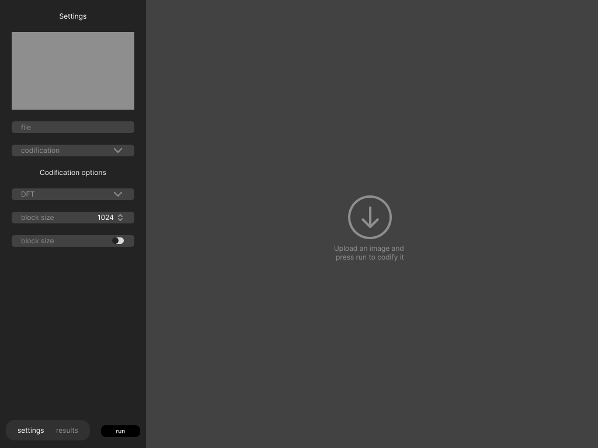
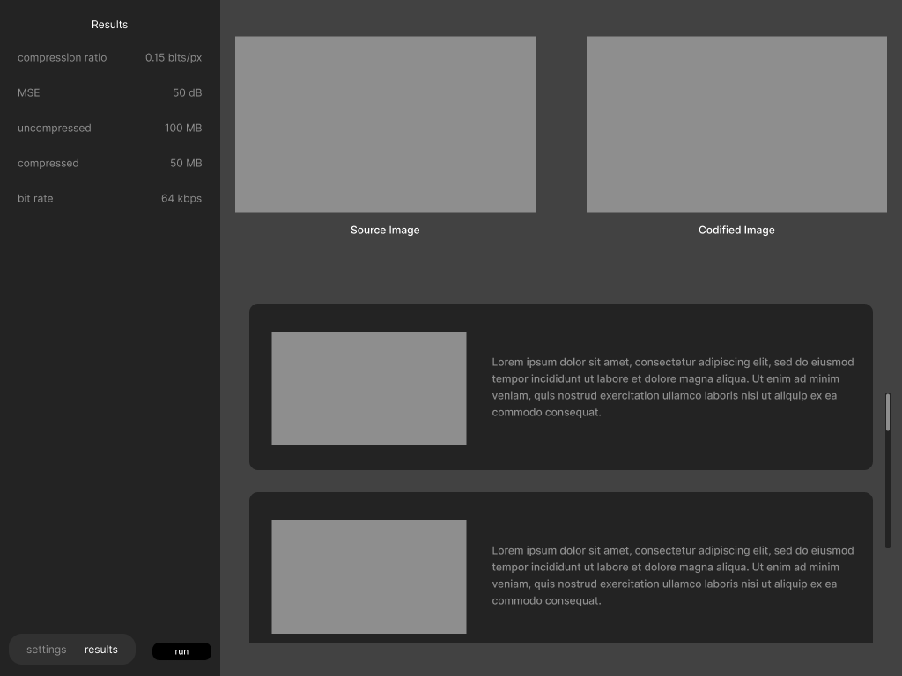

<h1 align="center">
    Onas
</h1>




## `App` class

```python
import customtkinter as ctk

class App(ctk.App): # or tk.Tk, where tk is the tkinter module
    def __init__(self):
        super().__init__(title="Onas")
        
        self.codification = None
        self.settings = {}
        self.results = {}
        self.steps = []
        self.image = None

        self.__init_navbar()
        self.__init_settings_tab()
        self.__init_results_tab()
    
    def __init_navbar(self):
        ...

    def __init_settings_tab(self):
        ...
    
    def __init__results_tab(self):
        ...

    def on_run(self):
        self.codification.configure(self.settings)
        self.results, self.steps = self.codification(input=self.image, parent=self.steps_frame)
        self.fill_results()
    
    def fill_results(self):
        ...

if __name__ == "__main__":
    app = App()
    app.mainloop()
```

## `Codification` class

```pythonclass JPEG:
    def __init__(self):
        self.fft_options = {
            "DCT": self.dct,
            "KLT": self.klt,
            "FFT": self.fft
        }
    
    def options(self) -> dict:
        return {
            "Transform": {
                "type": "combobox",
                "values": ["DCT", "KLT", "FFT"],
                "default": "DCT"
            },
            "Quantization Factor": {
                "type": "spinbox",
                "values": [1, 100, 1],
                "default": 1
            },
            "Block Size": {
                "type": "combobox",
                "values": ["8", "16", "32", "64", "128"],
                "default": "8"
            },
        }
    
    def steps(self, steps_parent) -> list:
        return [
            ...
        ]
    
    def configure(self, **kwargs):
        self.fft_algorithm = kwargs.get("Transform", "DCT")
        self.quantization_factor = kwargs.get("Quantization Factor", 1)
        self.block_size = int(kwargs.get("Block Size", "8"))

    def __call__(self, image):
        self.blocks = self.create_blocks(image, self.block_size)
        self.transformed_blocks = self.transform_blocks(self.blocks)
        self.quantized_blocks = self.quantize_blocks(self.transformed_blocks)
        self.encoded_blocks = self.encode_blocks(self.quantized_blocks)
        self.reconstructed_image = self.reconstruct_image(self.encoded_blocks)
        return {
            "image": self.reconstructed_image,
            "snr": snr(image, self.reconstructed_image)
        }

    def create_blocks(self, image, block_size):
        pass

    def transform_blocks(self, blocks):
        return [self.fft_options[self.fft_algorithm](block) for block in blocks]

    def dct(self, block):
        pass

    def klt(self, block):
        pass

    def fft(self, block):
        pass

    def quantize_blocks(self, blocks):
        pass

    def encode_blocks(self, blocks):
        pass

    def reconstruct_image(self, blocks):
        pass
```

<h3>Utility links:</h3>

- executable file: https://www.youtube.com/watch?v=Iv_dECet_oM&ab_channel=CodeFirstwithHala
- file dialogs: https://www.youtube.com/watch?v=oZpTv6Z629c&ab_channel=CodersLegacy

